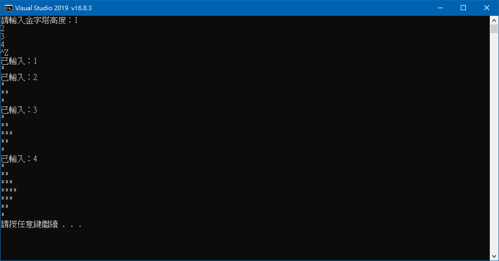

# 金字塔建築師。

此專案使用先行編譯標頭檔 (Precompiled.pch)。

預期要在重新導向來自動輸入金字塔高度 `GreatPyramid.exe < PyramidTester.txt`
```
1
2
3
4
^Z
```
不過手動輸入反而行得通。
  
`PyramidTester.txt` 改用 UTF-16LE 編碼，`GreatPyramid.exe < PyramidTester.txt` 就成功了。
```
_setmode(_fileno(stdin), _O_WTEXT);
_setmode(_fileno(stdout), _O_WTEXT);
_setmode(_fileno(stderr), _O_WTEXT);
```
不過這是因為使用了寬字元的模式，所以也不需要 `chcp 65001` 指令的 Unicode (UTF-8) 模式。
  
也因此麻煩的地方在於微軟編譯器，所有的 .h .cpp 原始碼檔案，需要使用 UTF-8-BOM 編碼。
  
否則會跳錯：
```
GreatPyramid.cpp(1): warning C4819: 檔案含有無法在目前字碼頁 (950) 中表示的字元。請以 Unicode 格式儲存檔案以防止資料遺失
```
這就是為何開放原始碼的跨平台函式庫，出現一堆這類錯誤在 Windows 平台上。


