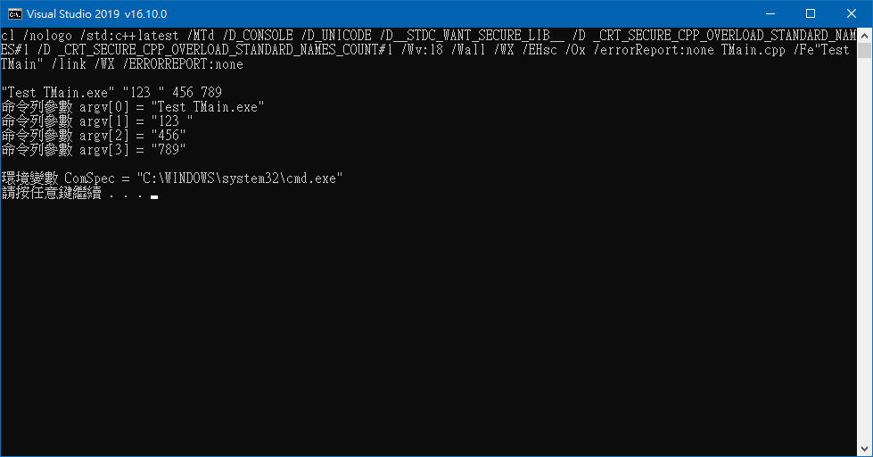

# TMain

## 宣告巨集
禁止使用 **`#define _CRT_SECURE_NO_WARNINGS`**

宣告 **`#define _CRT_SECURE_CPP_OVERLOAD_STANDARD_NAMES 1`**  
以及 **`#define _CRT_SECURE_CPP_OVERLOAD_STANDARD_NAMES_COUNT 1`**

### 參考文獻
[Support for Unicode | Microsoft Docs](https://docs.microsoft.com/en-us/cpp/text/support-for-unicode?view=msvc-160)  
[Support for Using wmain | Microsoft Docs](https://docs.microsoft.com/en-us/cpp/text/support-for-using-wmain?view=msvc-160)  
[Unicode Programming Summary | Microsoft Docs](https://docs.microsoft.com/en-us/cpp/text/unicode-programming-summary?view=msvc-160)  
[Generic-Text Mappings in tchar.h | Microsoft Docs](https://docs.microsoft.com/en-us/cpp/text/generic-text-mappings-in-tchar-h?view=msvc-160)  
[Secure Template Overloads | Microsoft Docs](https://docs.microsoft.com/en-us/cpp/c-runtime-library/secure-template-overloads?view=msvc-160)
